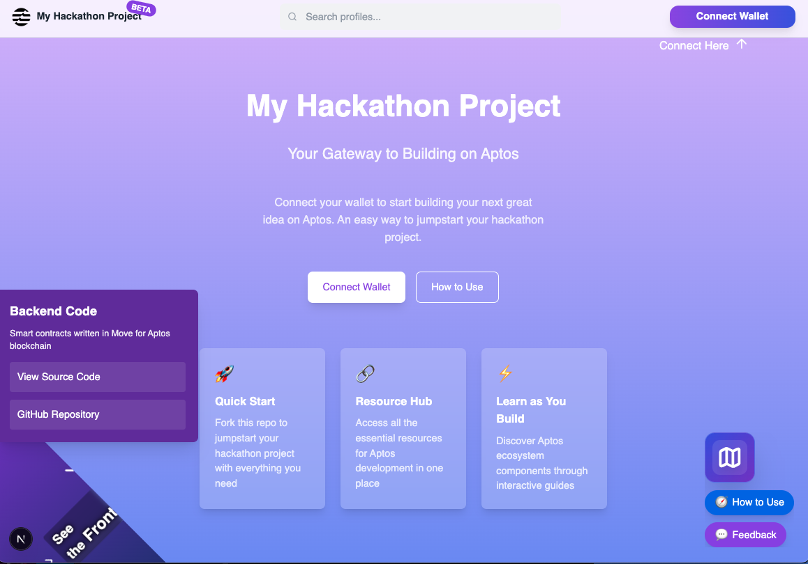

# My Hackathon Project



## What is My Hackathon Project?

My Hackathon Project is an interactive learning experience designed for hackathon participants to quickly understand how to build fullstack dApps on Aptos. It serves as both a demonstration of Aptos capabilities and a starter template that can be easily forked and customized for hackathon projects.

The platform showcases key features of the Aptos blockchain and Move programming language while providing hands-on learning through guided tours, interactive elements, and comprehensive documentation.

## Features

- **Interactive Guided Tours**: Step-by-step walkthroughs of key concepts and features
- **Component Map**: Visual representation of Aptos ecosystem components and relationships
- **Profile Creation**: Create a personal profile linked to your ANS name
- **Bio & Link Management**: Manage your profile information and external links
- **Code Corner**: Quick access to both frontend and backend code examples
- **TurboTax-Style Guidance**: Intuitive decision-making process for building dApps

## Technology Stack

- **Smart Contract**: Move programming language on Aptos blockchain
- **Frontend**: Next.js, TypeScript, React
- **Wallet Connection**: Aptos Wallet Adapter
- **Name Resolution**: Aptos Name Service (ANS)
- **Styling**: Tailwind CSS

## Getting Started

### Prerequisites

- Node.js (latest LTS recommended)
- pnpm, npm, or yarn package manager
- Aptos CLI (for contract deployment)
- An Aptos wallet (such as Petra)

### Running Locally

1. Clone the repository:
   ```
   git clone https://github.com/aptoslabs/hackathon-project.git
   cd hackathon-project
   ```

2. Install frontend dependencies:
   ```
   cd typescript/
   pnpm install  # or npm install
   ```

3. Start the development server:
   ```
   pnpm dev  # or npm run dev
   ```

4. Open your browser and navigate to `http://localhost:3000`

> **Note:** The application is configured to use testnet by default. You can modify the `constants.ts` file to switch to mainnet.

### Smart Contract Deployment

1. Navigate to the Move directory:
   ```
   cd move/
   ```

2. Compile the contract using the Aptos CLI:
   ```
   aptos move compile
   ```

3. Publish to testnet (example with Aptos CLI 'default' account configured):
   ```
   aptos move publish --named-addresses profile_address=default
   ```

4. Update the `CONTRACT_ADDRESS` in `typescript/src/constants.ts` with your deployed contract address.

## Interactive Learning Elements

### 1. Guided Tours

The application includes interactive tours that guide users through various aspects of the platform:

- **How to Use Tour**: Basic introduction to the application functionality
- **Component Map Tour**: Deep dive into Aptos ecosystem components

### 2. Code Corner

A page corner flip component that allows switching between frontend and backend code examples:

- **Frontend Code**: Next.js, React, and TailwindCSS implementation details
- **Backend Code**: Move smart contract examples and explanations

### 3. TurboTax-Style Decision Making

A step-by-step wizard that helps users make decisions about their Aptos dApp:

- Choose appropriate components
- Understand tradeoffs
- Get recommendations based on project requirements

## Architecture

### Smart Contract (Move)

The core functionality is powered by a Move contract that manages profile data on-chain:

- **Bio**: Stores profile information (name, description, avatar)
- **LinkTree**: Manages links using a SimpleMap
- **ProfileRef**: Associates accounts with profile objects
- **Events**: Emitted for indexing profile creations and updates

```move
struct Bio has key, store {
    name: String,
    image_url: String,
    description: String,
}
```

### Frontend (Next.js)

The frontend provides a user-friendly interface with:

- **Public Profiles**: Resolved from ANS names (e.g., `username.apt`)
- **Profile Editor**: For authenticated users to manage their profiles
- **Wallet Connection**: Using Aptos Connect for authentication
- **Interactive UI Elements**: Tours, tooltips, and guided experiences
- **Responsive Design**: For optimal viewing on all devices

## Implementation Progress

### Completed

- ✅ Rebranding to "My Hackathon Project"
- ✅ Enhanced UI with clearer calls to action
- ✅ Fixed tooltip positioning with darkened background
- ✅ Improved button organization with conditional rendering
- ✅ Added Code Corner Flip for frontend/backend code viewing
- ✅ Implemented Map button placeholder
- ✅ Enhanced text readability and component visibility

### In Progress

- 🔄 TurboTax-style component map
- 🔄 Knowledge collection system
- 🔄 Resource link collection
- 🔄 Enhanced project boilerplate structure

## Contributing

Feel free to fork this project and build your own version or extension. If you've made improvements that you think would benefit the original project, open a pull request.

For feature requests or bug reports, open a GitHub issue [here](https://github.com/aptoslabs/hackathon-project/issues).

## License

[MIT License](typescript/LICENSE)

---

*This project is designed as an interactive learning experience for the Aptos May 2025 Hackathon.*

