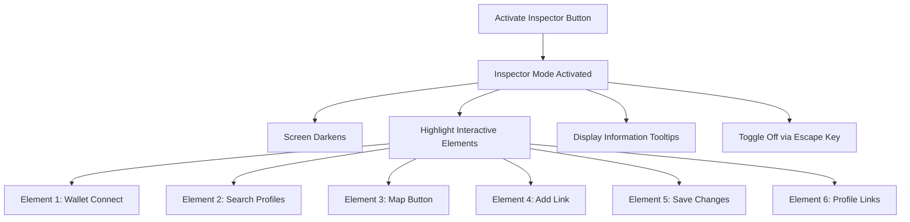

# Profile Inspector Feature Specification

This document outlines the implementation plan for a new "Inspector Mode" feature that allows users to learn about the different interactive elements on profile pages.

## Feature Overview

The Inspector feature will add a new button to profile views (both personal profile editing and public profile viewing) that enables users to explore the functionality of various UI elements. When activated, the screen darkens except for inspectable elements, drawing attention to the key interactive components of the interface.



## UI Implementation

### 1. Inspector Button

```typescript
// components/InspectorButton.tsx
"use client";

import React from 'react';
import { Search } from 'lucide-react';
import { Button } from './ui/button';
import { useInspector } from '@/hooks/useInspector';

interface InspectorButtonProps {
  className?: string;
}

export function InspectorButton({ className }: InspectorButtonProps) {
  const { activateInspector } = useInspector();
  
  return (
    <Button
      onClick={activateInspector}
      variant="outline"
      className={`flex items-center gap-2 w-full mt-2 ${className}`}
      aria-label="Activate inspector mode"
    >
      <Search size={16} />
      <span>Activate Inspector! 🔍</span>
    </Button>
  );
}
```

### 2. Inspector Overlay and Context

```typescript
// hooks/useInspector.tsx
"use client";

import React, { createContext, useContext, useState, useEffect } from 'react';

interface InspectorContextType {
  isActive: boolean;
  activateInspector: () => void;
  deactivateInspector: () => void;
  activeElementId: string | null;
  setActiveElementId: (id: string | null) => void;
}

const InspectorContext = createContext<InspectorContextType | undefined>(undefined);

export function InspectorProvider({ children }: { children: React.ReactNode }) {
  const [isActive, setIsActive] = useState(false);
  const [activeElementId, setActiveElementId] = useState<string | null>(null);
  
  const activateInspector = () => setIsActive(true);
  const deactivateInspector = () => {
    setIsActive(false);
    setActiveElementId(null);
  };
  
  // Handle escape key to exit inspector mode
  useEffect(() => {
    const handleKeyDown = (e: KeyboardEvent) => {
      if (e.key === 'Escape' && isActive) {
        deactivateInspector();
      }
    };
    
    window.addEventListener('keydown', handleKeyDown);
    return () => window.removeEventListener('keydown', handleKeyDown);
  }, [isActive]);
  
  return (
    <InspectorContext.Provider
      value={{
        isActive,
        activateInspector,
        deactivateInspector,
        activeElementId,
        setActiveElementId,
      }}
    >
      {children}
      {isActive && <InspectorOverlay />}
    </InspectorContext.Provider>
  );
}

export function useInspector() {
  const context = useContext(InspectorContext);
  if (context === undefined) {
    throw new Error('useInspector must be used within an InspectorProvider');
  }
  return context;
}

function InspectorOverlay() {
  const { deactivateInspector } = useInspector();
  
  return (
    <div 
      className="fixed inset-0 bg-black/70 z-40 overflow-hidden"
      onClick={deactivateInspector}
      aria-label="Exit inspector mode"
      role="button"
      tabIndex={0}
    >
      <div className="fixed top-4 right-4 bg-white rounded-md px-3 py-2 text-sm">
        Press ESC to exit inspector mode
      </div>
    </div>
  );
}
```

### 3. Inspector Highlight Component

```typescript
// components/InspectorHighlight.tsx
"use client";

import React, { useRef, useEffect, useState } from 'react';
import { useInspector } from '@/hooks/useInspector';

interface InspectorHighlightProps {
  elementId: string;
  description: string;
  children: React.ReactNode;
}

export function InspectorHighlight({ 
  elementId, 
  description, 
  children 
}: InspectorHighlightProps) {
  const { isActive, activeElementId, setActiveElementId } = useInspector();
  const elementRef = useRef<HTMLDivElement>(null);
  const [tooltipPosition, setTooltipPosition] = useState({ top: 0, left: 0 });
  
  useEffect(() => {
    if (isActive && elementRef.current) {
      // Calculate element position for tooltip
      const rect = elementRef.current.getBoundingClientRect();
      setTooltipPosition({
        top: rect.top + window.scrollY + rect.height + 8,
        left: rect.left + window.scrollX + (rect.width / 2),
      });
    }
  }, [isActive, activeElementId]);
  
  if (!isActive) {
    return <>{children}</>;
  }
  
  const isActive = activeElementId === elementId;
  
  return (
    <div 
      ref={elementRef}
      className={`relative z-50 ${isActive ? 'inspector-active' : ''}`}
      onClick={(e) => {
        e.stopPropagation();
        setActiveElementId(elementId);
      }}
      onMouseEnter={() => setActiveElementId(elementId)}
      onMouseLeave={() => setActiveElementId(null)}
    >
      <div className="relative">
        {children}
        <div className="absolute inset-0 bg-purple-500/20 rounded-md" />
      </div>
      
      {isActive && (
        <div 
          className="fixed bg-white rounded-md shadow-lg p-3 z-50 max-w-xs"
          style={{
            top: `${tooltipPosition.top}px`,
            left: `${tooltipPosition.left}px`,
            transform: 'translateX(-50%)',
          }}
        >
          <p className="text-sm font-medium">{elementId}</p>
          <p className="text-xs text-gray-600">{description}</p>
        </div>
      )}
    </div>
  );
}
```

### 4. Integration with Profile Components

#### 4.1 Update PublicProfile Component

```typescript
// components/PublicProfile.tsx
"use client";

import { InspectorHighlight } from './InspectorHighlight';
import { InspectorButton } from './InspectorButton';
// ... other imports

export function PublicProfile({ /* props */ }) {
  // ... existing component code
  
  return (
    <div className="container mx-auto p-4">
      {/* ... existing profile content */}
      
      <div className="mt-4 space-y-2">
        <InspectorHighlight 
          elementId="View Your Public Profile"
          description="View your public profile as others would see it"
        >
          <Button variant="outline" className="w-full">
            View Your Public Profile
          </Button>
        </InspectorHighlight>
        
        <InspectorButton />
      </div>
      
      {/* Wrap other interactive elements in InspectorHighlight */}
      <InspectorHighlight
        elementId="Profile Links"
        description="Links you've added to your profile are displayed here for viewers"
      >
        {/* Links section */}
      </InspectorHighlight>
    </div>
  );
}
```

#### 4.2 Update ProfileEditor Component

```typescript
// components/ProfileEditor.tsx
"use client";

import { InspectorHighlight } from './InspectorHighlight';
import { InspectorButton } from './InspectorButton';
// ... other imports

export function ProfileEditor({ /* props */ }) {
  // ... existing component code
  
  return (
    <div className="container mx-auto p-4">
      {/* ... existing editor content */}
      
      <div className="space-y-4">
        <InspectorHighlight 
          elementId="Wallet Connect"
          description="Connect your Aptos wallet to manage your profile"
        >
          {/* Wallet selector component */}
        </InspectorHighlight>
        
        <InspectorHighlight 
          elementId="Add Link"
          description="Add external links to your profile"
        >
          <Button className="w-full mb-2">Add Link</Button>
        </InspectorHighlight>
        
        <InspectorHighlight 
          elementId="Save Changes"
          description="Save your profile changes to the blockchain"
        >
          <Button className="w-full mb-2">Save Changes</Button>
        </InspectorHighlight>
        
        <InspectorHighlight 
          elementId="View Your Public Profile"
          description="View your public profile as others would see it"
        >
          <Button variant="outline" className="w-full mb-2">
            View Your Public Profile
          </Button>
        </InspectorHighlight>
        
        <InspectorButton />
      </div>
    </div>
  );
}
```

### 5. CSS Styling

Add the following styles to the global CSS file:

```css
/* In globals.css */
.inspector-active {
  position: relative;
  z-index: 50;
  animation: pulse 2s infinite;
}

@keyframes pulse {
  0% {
    box-shadow: 0 0 0 0 rgba(124, 58, 237, 0.7);
  }
  70% {
    box-shadow: 0 0 0 10px rgba(124, 58, 237, 0);
  }
  100% {
    box-shadow: 0 0 0 0 rgba(124, 58, 237, 0);
  }
}
```

## Inspectable Elements

The following elements should be highlighted in Inspector mode:

1. **Wallet Connect Area**
   - Description: "Connect your Aptos wallet to manage your profile"
   - Functionality: Explains the wallet connection process

2. **Search Profiles**
   - Description: "Search for other profiles by their ANS name"
   - Functionality: Highlights the search functionality

3. **Map Button**
   - Description: "Access the interactive component map to learn about Aptos ecosystem"
   - Functionality: Explains the purpose of the map feature

4. **Add Link Button**
   - Description: "Add external links to your profile"
   - Functionality: Explains how to add links

5. **Save Changes Button**
   - Description: "Save your profile changes to the blockchain"
   - Functionality: Explains how changes are saved on-chain

6. **Profile Links**
   - Description: "Links you've added to your profile"
   - Functionality: Shows how added links appear

## Implementation Steps

1. Create the inspector context provider and hooks
2. Implement the InspectorButton component
3. Build the InspectorHighlight component
4. Update the profile components to include the Inspector button
5. Wrap inspectable elements in InspectorHighlight components
6. Add necessary CSS styles
7. Test the feature across different screen sizes

## Accessibility Considerations

- Allow keyboard navigation with Tab key between inspectable elements
- Provide exit mechanism via Escape key
- Ensure all tooltips have sufficient color contrast
- Include aria-labels for screen reader support
- Maintain focus management when inspector is active

## Best Practices

- Use the shadcn/ui Button component for the Inspector button
- Apply consistent styling with the rest of the application
- Maintain responsive design across all screen sizes
- Ensure tooltips don't overflow on smaller screens
- Add clear visual indicators for interactive elements

This Inspector feature will enhance the learning experience by providing contextual information about different UI components, making it easier for users to understand the application's functionality.