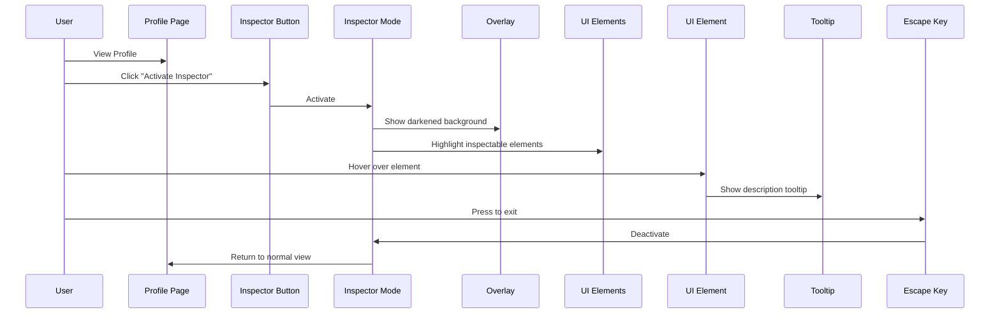

# Inspector Feature Visual Guide

This document provides a visual representation of the Inspector feature's UI and interaction patterns to help developers understand how it should look and function.

## Feature Flow Diagram



## UI States

### 1. Normal Profile View

```
┌─────────────────────────────────────────┐
│                                         │
│           Edit Your Profile             │
│                                         │
│           ┌─────────────┐               │
│           │   Avatar    │               │
│           └─────────────┘               │
│                                         │
│           username.apt                  │
│                                         │
│ ┌─────────────────────────────────────┐ │
│ │ Link: https://example.com           │ │
│ └─────────────────────────────────────┘ │
│                                         │
│ ┌─────────────────────┐ ┌─────────────┐ │
│ │     Add Link        │ │Save Changes │ │
│ └─────────────────────┘ └─────────────┘ │
│                                         │
│ ┌─────────────────────────────────────┐ │
│ │       View Your Public Profile      │ │
│ └─────────────────────────────────────┘ │
│                                         │
│ ┌─────────────────────────────────────┐ │
│ │      Activate Inspector! 🔍         │ │
│ └─────────────────────────────────────┘ │
│                                         │
└─────────────────────────────────────────┘
```

### 2. Inspector Mode Activated

```
┌─────────────────────────────────────────┐
│                                         │
│ ┌─────────────┐  Press ESC to exit      │
│ │Edit Profile │                         │
│ └─────────────┘                         │
│                                         │
│           ┌─────────────┐               │
│           │   Avatar    │               │
│           └─────────────┘               │
│                                         │
│           username.apt                  │
│                                         │
│ ┌─────────────────────────────────────┐ │
│ │ Link: https://example.com           │ │
│ │                                     │ │
│ │ ┌─────────────────────────────────┐ │ │
│ │ │     Profile Links               │ │ │
│ │ │                                 │ │ │
│ │ │ Links you've added to your      │ │ │
│ │ │ profile are displayed here      │ │ │
│ │ └─────────────────────────────────┘ │ │
│ └─────────────────────────────────────┘ │
│                                         │
│ ┌─────────────────────┐ ┌─────────────┐ │
│ │     Add Link        │ │Save Changes │ │
│ └─────────────────────┘ └─────────────┘ │
│                                         │
│ ┌─────────────────────────────────────┐ │
│ │       View Your Public Profile      │ │
│ └─────────────────────────────────────┘ │
│                                         │
│ ┌─────────────────────────────────────┐ │
│ │      Deactivate Inspector           │ │
│ └─────────────────────────────────────┘ │
│                                         │
└─────────────────────────────────────────┘
```

## Mobile View

### Inspector Mode on Mobile

```
┌─────────────────────┐
│                     │
│   Edit Profile      │
│                     │
│   ┌───────────┐     │
│   │  Avatar   │     │
│   └───────────┘     │
│                     │
│   username.apt      │
│                     │
│ ┌─────────────────┐ │
│ │Profile Link     │ │
│ │                 │ │
│ │ ┌─────────────┐ │ │
│ │ │ Tooltip     │ │ │
│ │ │             │ │ │
│ │ └─────────────┘ │ │
│ └─────────────────┘ │
│                     │
│ ┌─────────────────┐ │
│ │    Add Link     │ │
│ └─────────────────┘ │
│                     │
│ ┌─────────────────┐ │
│ │  Save Changes   │ │
│ └─────────────────┘ │
│                     │
│ ┌─────────────────┐ │
│ │ View Profile    │ │
│ └─────────────────┘ │
│                     │
│ (ESC to exit)       │
└─────────────────────┘
```

## UI Component Examples

### 1. Inspector Button

```
┌───────────────────────────────┐
│                               │
│  Activate Inspector! 🔍       │
│                               │
└───────────────────────────────┘
```

### 2. Element Highlight with Tooltip

```
┌─────────────────────────────────────┐
│                                     │
│          Add Link                   │
│                                     │
└─────────────────────────────────────┘
         │
         ▼
┌─────────────────────────────────────┐
│ Add Link                            │
│                                     │
│ Add external links to your profile  │
│ that will be displayed publicly     │
└─────────────────────────────────────┘
```

### 3. Inspector Overlay Exit Message

```
┌───────────────────────────┐
│                           │
│  Press ESC to exit        │
│  inspector mode           │
│                           │
└───────────────────────────┘
```

## Visual Effects

### Highlighted Element Animation

The highlighted elements should have a subtle pulse animation to indicate they are interactive:

```css
@keyframes pulse {
  0% {
    box-shadow: 0 0 0 0 rgba(124, 58, 237, 0.7);
  }
  70% {
    box-shadow: 0 0 0 10px rgba(124, 58, 237, 0);
  }
  100% {
    box-shadow: 0 0 0 0 rgba(124, 58, 237, 0);
  }
}
```

### Color Scheme

- **Background Overlay**: Semi-transparent black (`rgba(0,0,0,0.7)`)
- **Highlight Border**: Purple (`#7c3aed`)
- **Tooltip Background**: White (`#ffffff`)
- **Tooltip Text**: Dark gray (`#333333`)
- **Tooltip Description**: Medium gray (`#666666`)

## Interactive Elements

This table shows all elements that should be interactive in Inspector mode:

| Element | Location | Description |
|---------|----------|-------------|
| Wallet Connect | Top nav | "Connect your Aptos wallet to manage your profile" |
| Search Input | Top nav | "Search for profiles using ANS names" |
| Map Button | Bottom-right corner | "Access the interactive component map" |
| Add Link | Profile editor | "Add external links to your profile" |
| Save Changes | Profile editor | "Save your profile updates to the blockchain" |
| Profile Links | Profile view | "Links you've added to your profile" |

## Visual Transitions

1. **Enter Inspector Mode**:
   - Background gradually darkens (300ms transition)
   - Elements fade in with highlighting (200ms delay, 300ms transition)
   - Exit message appears in top-right (fade in)

2. **Element Interaction**:
   - Hover: Border highlight intensifies
   - Tooltip: Fades in (150ms)
   - Pulse animation: Continuous subtle effect

3. **Exit Inspector Mode**:
   - Background lightens (300ms transition)
   - Highlights fade out (200ms transition)
   - Return to normal UI state

## Implementation Examples

### Button in Profile View

Before (normal view):

```jsx
<Button className="w-full mt-4">View Your Public Profile</Button>
```

After (with inspector support):

```jsx
<InspectorHighlight
  elementId="View Your Public Profile"
  description="View your profile as others would see it"
>
  <Button className="w-full mt-4">View Your Public Profile</Button>
</InspectorHighlight>

<InspectorButton className="mt-2" />
```

### React Component UI States

```jsx
// Public Profile Component with Inspector integration
function PublicProfile() {
  // Get inspector state from context
  const { isActive } = useInspector();
  
  return (
    <div className={isActive ? "inspector-mode" : ""}>
      <ProfileHeader />
      
      <InspectorHighlight
        elementId="Profile Links"
        description="Links added to this profile"
      >
        <ProfileLinks />
      </InspectorHighlight>
      
      {/* Only show in edit mode */}
      {isEditMode && (
        <>
          <InspectorButton />
        </>
      )}
    </div>
  );
}
```

## Inspector Mode Keyboard Navigation

Tab sequence for keyboard users:

1. First inspectable element
2. Second inspectable element
3. ...
4. Last inspectable element
5. Exit button (or press ESC)

## Accessibility Overlay

For screen reader users, the inspector mode should announce:

1. "Inspector mode activated" when entering
2. Element name and description when focused
3. "Press Escape to exit inspector mode" instruction
4. "Inspector mode deactivated" when exiting

This visual guide, along with the specification and implementation guide, should provide developers with a comprehensive understanding of how to build the Inspector feature according to project requirements and best practices.