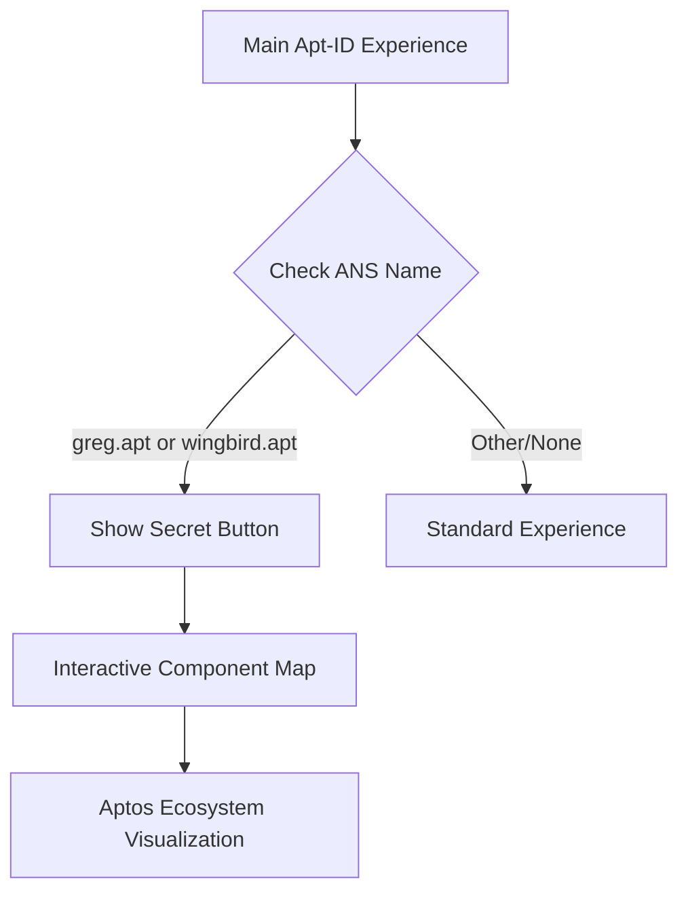

# Secret Access Feature for Apt-ID Interactive Experience

This document outlines the design and implementation plan for adding a "secret access" feature to the Apt-ID interactive prototype. This feature will check if a user has a specific Aptos Name (greg.apt or wingbird.apt) and provide access to an exclusive interactive component map of the Aptos ecosystem.

## Feature Overview



### Key Components

1. **ANS Name Verification**
   - Simulate checking if the connected wallet owns greg.apt or wingbird.apt
   - In the prototype, this will be UI-based (select from dropdown)
   - In production, would connect to actual ANS resolver

2. **Secret Access UI Elements**
   - Hidden button that appears only for allowlisted users
   - Visual indication of exclusive access (e.g., special badge)

3. **Interactive Component Map**
   - Visualization of Aptos ecosystem components and their relationships
   - Based on the decision pathway diagram from feedback
   - Interactive elements showing connections between components

## Implementation Plan for Prototype

### 1. Add ANS Name Selection

```html
<div class="panel allowlist-panel">
  <div class="panel-header">
    <h2>ANS Name Simulation</h2>
  </div>
  <div>
    <label>Simulate ANS Name:</label>
    <select id="ans-name-selector">
      <option value="none">No ANS Name</option>
      <option value="greg.apt">greg.apt</option>
      <option value="wingbird.apt">wingbird.apt</option>
      <option value="other.apt">other.apt</option>
    </select>
  </div>
</div>
```

### 2. Implement Secret Button Logic

```javascript
document.getElementById('ans-name-selector').addEventListener('change', function() {
  const selectedName = this.value;
  const secretButton = document.getElementById('secret-access-button');
  
  if (selectedName === 'greg.apt' || selectedName === 'wingbird.apt') {
    secretButton.style.display = 'flex';
    
    // Add special badge to profile
    document.getElementById('special-badge').style.display = 'block';
  } else {
    secretButton.style.display = 'none';
    document.getElementById('special-badge').style.display = 'none';
  }
});
```

### 3. Create Secret Component Map UI

```html
<div id="component-map-modal" class="modal">
  <div class="modal-content">
    <span class="close-modal">&times;</span>
    <h2>Aptos Component Interactive Map</h2>
    <div class="component-map-container">
      <!-- Interactive SVG map will go here -->
    </div>
  </div>
</div>
```

### 4. Design Interactive Component Map

The component map will be based on the "Hacker's Decision Pathway" from the feedback, visualizing:

1. **Decision Points**
   - Chain Selection (Aptos vs others)
   - Move Contract Approach (AI-generated, template, migration)
   - Frontend Identity & Wallets
   - Data & Indexing
   - Deployment & Testing

2. **Components & Connections**
   - Move VM / Contract Layer
   - Aptos Connect / Wallet
   - No-Code Indexer
   - Deployment Tools
   - APIs and SDKs

```javascript
function createComponentMap() {
  const container = document.querySelector('.component-map-container');
  
  // SVG or Canvas-based visualization
  const svg = document.createElementNS("http://www.w3.org/2000/svg", "svg");
  svg.setAttribute("width", "800");
  svg.setAttribute("height", "600");
  
  // Create decision nodes
  createDecisionNode(svg, "Start: I want to build a dApp", 400, 50);
  createDecisionNode(svg, "1. Evaluate Aptos or Another Chain?", 400, 120);
  // ... additional nodes and connections
  
  container.appendChild(svg);
  
  // Add interactivity
  addNodeInteractions();
}
```

## UI/UX Design

### Secret Button Design

The secret button should:
- Appear subtly in the UI when the user has an allowlisted ANS name
- Have a distinctive style that indicates exclusivity
- Animate or glow to attract attention without being obtrusive

```css
.secret-button {
  display: none;
  position: fixed;
  bottom: 20px;
  right: 20px;
  background: linear-gradient(135deg, var(--primary-color), #9b6dff);
  color: white;
  border: none;
  padding: 12px 20px;
  border-radius: 30px;
  box-shadow: 0 4px 15px rgba(111, 75, 213, 0.4);
  cursor: pointer;
  font-weight: 600;
  transition: all 0.3s ease;
  animation: pulse 2s infinite;
}

@keyframes pulse {
  0% { box-shadow: 0 0 0 0 rgba(111, 75, 213, 0.7); }
  70% { box-shadow: 0 0 0 10px rgba(111, 75, 213, 0); }
  100% { box-shadow: 0 0 0 0 rgba(111, 75, 213, 0); }
}
```

### Component Map Visual Style

The component map should:
- Use a clean, modern design that matches the main prototype
- Highlight connections between components with animated lines
- Provide interactive tooltips on hover for additional information
- Allow zooming and panning for complex visualizations

## Technical Implementation Notes

### 1. ANS Name Verification (Production Version)

In a production implementation, the ANS name verification would:
- Connect to the user's wallet using Aptos SDK
- Query the ANS service to check owned names
- Verify ownership against the allowlist
- Update UI based on verification results

```javascript
// Pseudocode for production implementation
async function verifyANSName(walletAddress) {
  try {
    const names = await aptosClient.getAccountResource(
      walletAddress,
      '0x3::token::TokenStore'
    );
    
    // Parse names and check against allowlist
    const ownedNames = parseANSNames(names);
    return ownedNames.some(name => 
      ['greg.apt', 'wingbird.apt'].includes(name)
    );
  } catch (error) {
    console.error('Error verifying ANS name:', error);
    return false;
  }
}
```

### 2. Component Map (Production Version)

In a production implementation, the component map would:
- Load data dynamically from a configuration file
- Support filtering and searching components
- Track user interactions for analytics
- Potentially link to relevant documentation or tools

## User Flow

1. User loads the Apt-ID prototype
2. User selects an ANS name from the dropdown (simulating wallet connection)
3. If the selected name is on the allowlist (greg.apt or wingbird.apt):
   - A special badge appears on their profile
   - The secret button appears in the UI
4. User clicks the secret button to access the component map
5. The interactive map displays, showing Aptos ecosystem components
6. User can interact with the map to explore component relationships

## Testing Plan

To ensure this feature works correctly, we should test:

1. **Allowlist Functionality**
   - Verify that the secret button appears only for allowlisted names
   - Confirm that changing to a non-allowlisted name hides the button

2. **Component Map Rendering**
   - Test that all components render correctly
   - Verify that interactions (hover, click) work as expected

3. **Responsiveness**
   - Test the component map on different screen sizes
   - Ensure the modal is usable on both desktop and mobile

## Implementation Steps

1. Add ANS name simulation dropdown to the prototype
2. Create the secret button UI element (hidden by default)
3. Implement verification logic to show/hide the button
4. Design and implement the component map visualization
5. Add interaction handlers for the component map
6. Test all functionality and fix any issues

This feature will demonstrate how Apt-ID could implement exclusive content based on ANS name ownership, while showcasing an interactive visualization of the Aptos ecosystem components that would be valuable for hackathon participants.