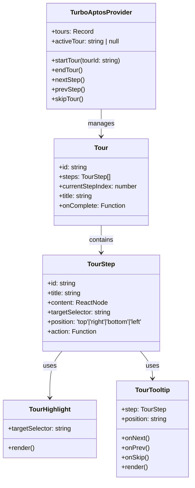
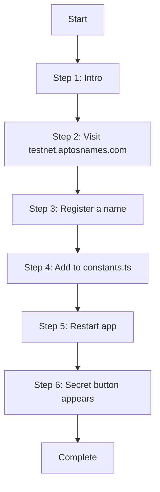
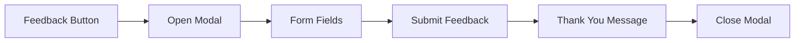
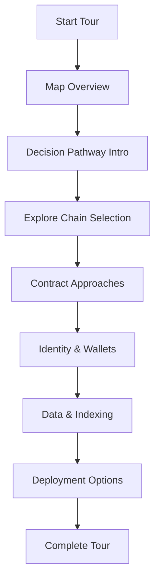

# TurboTax-Style Enhancements for Apt-ID

Based on your request, I've designed a comprehensive plan to enhance the Apt-ID application with TurboTax-style guided experiences and additional interactive elements. This plan outlines the architecture, implementation details, and user flow for each new feature.

## Overview of New Features

1. **TurboAptos Component** - A reusable guided tour system
2. **How to Use Button** - Walkthrough for getting testnet ANS names
3. **Feedback Modal** - Always-visible feedback collection
4. **Enhanced Secret Map** - Guided exploration of the component map

## 1. TurboAptos Core Component Design



### Implementation Files

1. `typescript/src/components/TurboAptos/TurboAptosProvider.tsx` - Context provider for tours
2. `typescript/src/components/TurboAptos/TourHighlight.tsx` - Highlight component
3. `typescript/src/components/TurboAptos/TourTooltip.tsx` - Step instruction tooltip
4. `typescript/src/components/TurboAptos/useTurboAptos.tsx` - Hook for accessing tour context
5. `typescript/src/components/TurboAptos/index.tsx` - Export file

### Core Type Definitions

```typescript
interface Tour {
  id: string;
  title: string;
  description: string;
  steps: TourStep[];
  onComplete?: () => void;
}

interface TourStep {
  id: string;
  title: string;
  content: React.ReactNode;
  targetSelector?: string;
  position: 'top' | 'right' | 'bottom' | 'left';
  action?: () => void | Promise<void>;
  waitForElement?: boolean;
}

interface TurboAptosContextType {
  activeTour: Tour | null;
  currentStep: TourStep | null;
  currentStepIndex: number;
  startTour: (tourId: string) => void;
  endTour: () => void;
  nextStep: () => void;
  prevStep: () => void;
  skipTour: () => void;
  isTourActive: boolean;
}
```

### Usage Example

```typescript
// Tour definition
const howToUseTour: Tour = {
  id: 'how-to-use',
  title: 'How to Use Apt-ID',
  description: 'Learn how to access the secret component map',
  steps: [
    {
      id: 'intro',
      title: 'Welcome to Apt-ID',
      content: 'This guide will help you access the secret component map',
      position: 'bottom'
    },
    // More steps...
  ],
  onComplete: () => {
    console.log('Tour completed!');
  }
};

// Using in a component
function MyComponent() {
  const { startTour } = useTurboAptos();
  
  return (
    <button onClick={() => startTour('how-to-use')}>
      Start Tour
    </button>
  );
}
```

## 2. How to Use Button and Walkthrough



### Button Component

The "How to Use" button will be positioned above the "Feedback" button in the bottom-right corner:

```typescript
export function HowToUseButton() {
  const { startTour } = useTurboAptos();
  
  return (
    <button 
      onClick={() => startTour('how-to-use')}
      className="fixed bottom-24 right-4 z-50 bg-blue-600 hover:bg-blue-700 text-white px-4 py-2 rounded-full shadow-lg"
    >
      <span className="mr-2">🧭</span>
      How to Use
    </button>
  );
}
```

### Tour Steps

1. **Introduction**
   - Welcome to Apt-ID
   - This guide will help you access the secret component map

2. **Visit Testnet ANS**
   - Go to testnet.aptosnames.com
   - Connect your wallet to browse available names

3. **Register a Name**
   - TIP: Longer names like 'tippitippi.apt' cost less testnet APT than short names like 'tippi.apt'
   - Select and register your name

4. **Add to Constants**
   - Locate the constants.ts file
   - Add your name to the ALLOWLISTED_NAMES array

5. **Restart App**
   - Run 'pnpm dev' (Greg always says "pnpm is faster!")
   - Wait for the app to reload

6. **Reveal Secret Button**
   - Connect your wallet
   - See the secret button appear

### Implementation Files

1. `typescript/src/components/HowToUseButton.tsx` - Button component
2. `typescript/src/tours/HowToUseTour.tsx` - Tour configuration

### Tour Configuration Example

```typescript
export const howToUseTour: Tour = {
  id: 'how-to-use',
  title: 'How to Access Secret Features',
  description: 'Learn how to get your own testnet ANS name and reveal the secret component map',
  steps: [
    {
      id: 'intro',
      title: 'Welcome to Apt-ID',
      content: (
        <div className="space-y-2">
          <p>Welcome to Apt-ID! This guide will help you access secret features available to users with specific ANS names.</p>
          <p>Follow along to get your own testnet ANS name and reveal hidden functionality.</p>
        </div>
      ),
      position: 'bottom'
    },
    {
      id: 'visit-ans',
      title: 'Visit Testnet ANS',
      content: (
        <div className="space-y-2">
          <p>First, visit <a href="https://testnet.aptosnames.com" target="_blank" rel="noopener noreferrer" className="text-blue-500 underline">testnet.aptosnames.com</a></p>
          <p>Connect your wallet to browse available names.</p>
          
        </div>
      ),
      position: 'bottom'
    },
    // More steps...
  ]
};
```

## 3. Feedback Modal



### Button Component

The Feedback button will be positioned between the "How to Use" button and the secret button:

```typescript
export function FeedbackButton() {
  const [isOpen, setIsOpen] = useState(false);
  
  return (
    <>
      <button 
        onClick={() => setIsOpen(true)}
        className="fixed bottom-16 right-4 z-50 bg-purple-600 hover:bg-purple-700 text-white px-4 py-2 rounded-full shadow-lg"
      >
        <span className="mr-2">💬</span>
        Feedback
      </button>
      
      <FeedbackModal open={isOpen} onOpenChange={setIsOpen} />
    </>
  );
}
```

### Modal Design

The feedback modal will include:

- 5-star rating system
- Category selection (UI, Feature request, Bug report)
- Text area for detailed feedback
- Email field (optional)
- Submit button

### Implementation Files

1. `typescript/src/components/FeedbackButton.tsx` - Button component
2. `typescript/src/components/FeedbackModal.tsx` - Modal with form

### Modal Component Example

```typescript
interface FeedbackModalProps {
  open: boolean;
  onOpenChange: (open: boolean) => void;
}

export function FeedbackModal({ open, onOpenChange }: FeedbackModalProps) {
  const [rating, setRating] = useState<number | null>(null);
  const [category, setCategory] = useState<string>('');
  const [feedback, setFeedback] = useState<string>('');
  const [email, setEmail] = useState<string>('');
  const [submitting, setSubmitting] = useState<boolean>(false);
  const [submitted, setSubmitted] = useState<boolean>(false);
  
  const handleSubmit = async (e: React.FormEvent) => {
    e.preventDefault();
    setSubmitting(true);
    
    // Simulate API call
    await new Promise(resolve => setTimeout(resolve, 1000));
    
    // In a real implementation, you would send the feedback to a server
    console.log({
      rating,
      category,
      feedback,
      email
    });
    
    setSubmitting(false);
    setSubmitted(true);
    
    // Reset form after a delay
    setTimeout(() => {
      setRating(null);
      setCategory('');
      setFeedback('');
      setEmail('');
      setSubmitted(false);
      onOpenChange(false);
    }, 3000);
  };
  
  return (
    <Dialog open={open} onOpenChange={onOpenChange}>
      <DialogContent className="max-w-md">
        <DialogHeader>
          <DialogTitle>Share Your Feedback</DialogTitle>
        </DialogHeader>
        
        {!submitted ? (
          <form onSubmit={handleSubmit} className="space-y-4">
            {/* Rating */}
            <div className="space-y-2">
              <label className="block text-sm font-medium">How would you rate your experience?</label>
              <div className="flex space-x-2">
                {[1, 2, 3, 4, 5].map((star) => (
                  <button
                    key={star}
                    type="button"
                    onClick={() => setRating(star)}
                    className={`text-2xl ${rating && star <= rating ? 'text-yellow-400' : 'text-gray-300'}`}
                  >
                    ★
                  </button>
                ))}
              </div>
            </div>
            
            {/* Category */}
            <div className="space-y-2">
              <label className="block text-sm font-medium">Feedback Category</label>
              <select
                value={category}
                onChange={(e) => setCategory(e.target.value)}
                className="w-full rounded-md border border-gray-300 p-2"
                required
              >
                <option value="">Select a category</option>
                <option value="ui">User Interface</option>
                <option value="feature">Feature Request</option>
                <option value="bug">Bug Report</option>
                <option value="other">Other</option>
              </select>
            </div>
            
            {/* Feedback */}
            <div className="space-y-2">
              <label className="block text-sm font-medium">Your Feedback</label>
              <textarea
                value={feedback}
                onChange={(e) => setFeedback(e.target.value)}
                className="w-full rounded-md border border-gray-300 p-2 min-h-[100px]"
                placeholder="What do you like? What could be improved?"
                required
              />
            </div>
            
            {/* Email (optional) */}
            <div className="space-y-2">
              <label className="block text-sm font-medium">Email (optional)</label>
              <input
                type="email"
                value={email}
                onChange={(e) => setEmail(e.target.value)}
                className="w-full rounded-md border border-gray-300 p-2"
                placeholder="For follow-up questions"
              />
            </div>
            
            {/* Submit */}
            <button
              type="submit"
              disabled={submitting}
              className="w-full bg-purple-600 hover:bg-purple-700 text-white py-2 rounded-md disabled:opacity-50"
            >
              {submitting ? 'Submitting...' : 'Submit Feedback'}
            </button>
          </form>
        ) : (
          <div className="py-8 text-center space-y-4">
            <div className="text-5xl">🎉</div>
            <h3 className="text-xl font-semibold">Thank You!</h3>
            <p>Your feedback has been submitted successfully.</p>
          </div>
        )}
      </DialogContent>
    </Dialog>
  );
}
```

## 4. Enhanced Secret Map Experience



### TurboTax-Style Enhancement Strategy

The existing ComponentMap will be enhanced with:

1. **Auto-starting tour** when first opened
2. **Sequential highlighting** of each decision point
3. **Detailed explanations** for each component
4. **Interactive elements** that respond to tour progress

### Implementation Approach

1. Integrate the ComponentMap with the TurboAptos system
2. Add tour configuration for the map
3. Enhance the UI with progress indicators
4. Add animation for transitions between steps

### Tour Steps

1. **Map Overview**
   - Welcome to the Aptos Component Map
   - This map visualizes the key decision points for hackathon projects

2. **Decision Pathway**
   - Follow the developer journey from start to finish
   - Click on nodes to see more details

3. **Chain Selection** (highlighting the first node)
   - This is where developers decide to use Aptos
   - Click to see the advantages of Aptos

4. **Contract Approaches** (highlighting the second node)
   - Three ways to create Move contracts
   - AI-generation is fastest for hackathons

5. **Identity & Wallets** (highlighting the third node)
   - Options for user authentication
   - Aptos Connect provides the best balance of security and UX

6. **Data & Indexing** (highlighting the fourth node)
   - Ways to access and process blockchain data
   - No-Code Indexer simplifies historical data access

7. **Deployment** (highlighting the fifth node)
   - Options for deploying your application
   - One-Click Deploy is fastest for hackathons

8. **Completion**
   - You've completed the tour of the Aptos Component Map
   - Explore on your own or start building your project

### Implementation Files

1. `typescript/src/components/ComponentMap.tsx` (enhanced)
2. `typescript/src/tours/ComponentMapTour.tsx` - Tour configuration

## UI Layout Design

```
+---------------------------------------------------------------+
|                         Apt-ID Header                         |
+---------------------------------------------------------------+
|                                                               |
|                                                               |
|                     Main Application Content                  |
|                                                               |
|                                                               |
|                                                               |
|                                                               |
|                                                               |
|                                                               |
|                                                               |
|                                                               |
|                                                               |
+---------------------------------------------------------------+
|                                                               |
|                                              +-------------+  |
|                                              | How to Use  |  |
|                                              +-------------+  |
|                                                               |
|                                              +-------------+  |
|                                              |  Feedback   |  |
|                                              +-------------+  |
|                                                               |
|                                              +-------------+  |
|                                              | Secret Btn  |  |
|                                              | (if allowed)|  |
|                                              +-------------+  |
|                                                               |
+---------------------------------------------------------------+
```

## Integration with Root Layout

The button stack will be integrated into the RootLayout:

```typescript
// Updated layout.tsx
export default function RootLayout({
  children,
}: {
  children: React.ReactNode;
}) {
  return (
    <html lang="en">
      <body>
        <WalletProvider>
          <TurboAptosProvider tours={[howToUseTour, componentMapTour]}>
            {children}
            
            {/* Button Stack (bottom right) */}
            <HowToUseButton />
            <FeedbackButton />
            <SecretButton />
            
            {/* Tour UI components */}
            <TourTooltip />
            <TourHighlight />
          </TurboAptosProvider>
        </WalletProvider>
      </body>
    </html>
  );
}
```

## Technical Considerations

1. **Persisting Tour Progress**
   - Use localStorage to remember which tours have been completed
   - Allow restarting tours from "How to Use" button

   ```typescript
   function saveTourProgress(tourId: string) {
     const completedTours = JSON.parse(localStorage.getItem('completedTours') || '[]');
     if (!completedTours.includes(tourId)) {
       completedTours.push(tourId);
       localStorage.setItem('completedTours', JSON.stringify(completedTours));
     }
   }
   ```

2. **Responsive Design**
   - Ensure tooltips position correctly on different screen sizes
   - Adjust highlight positions based on viewport

   ```typescript
   function calculatePosition(targetElement: HTMLElement, position: string) {
     const rect = targetElement.getBoundingClientRect();
     const viewportWidth = window.innerWidth;
     const viewportHeight = window.innerHeight;
     
     // Calculate optimal position based on viewport constraints
     // Return adjusted position
   }
   ```

3. **Accessibility**
   - Include keyboard navigation for the tours
   - Add aria attributes to tour elements

   ```typescript
   <div 
     role="dialog"
     aria-labelledby="tour-step-title"
     aria-describedby="tour-step-content"
   >
     <h3 id="tour-step-title">{step.title}</h3>
     <div id="tour-step-content">{step.content}</div>
     <div className="tour-controls">
       <button aria-label="Previous step" onClick={prevStep}>Back</button>
       <button aria-label="Next step" onClick={nextStep}>Next</button>
     </div>
   </div>
   ```

4. **Performance**
   - Lazy-load tour content to minimize initial load time
   - Only render active tour components

   ```typescript
   // Only render when tour is active
   {isTourActive && (
     <>
       <TourTooltip />
       <TourHighlight />
     </>
   )}
   ```

## Implementation Timeline

1. **Week 1: Core Components**
   - Implement TurboAptos provider and core components
   - Create basic tour functionality
   - Add How to Use and Feedback buttons

2. **Week 2: Tours and Integration**
   - Implement How to Use tour
   - Enhance ComponentMap with tour support
   - Integrate with existing Secret Button

3. **Week 3: Testing and Refinement**
   - End-to-end testing of all tours
   - Accessibility improvements
   - Performance optimization

## Next Steps

With this plan in place, I can begin implementing these TurboTax-style enhancements, focusing first on:

1. The reusable TurboAptos tour system
2. The always-visible Feedback modal button
3. The How-to-Use button with ANS name walkthrough
4. The enhanced secret map experience

This implementation will significantly improve the user experience, making it easier for new developers to understand and use Apt-ID, while also providing a mechanism for collecting valuable user feedback.