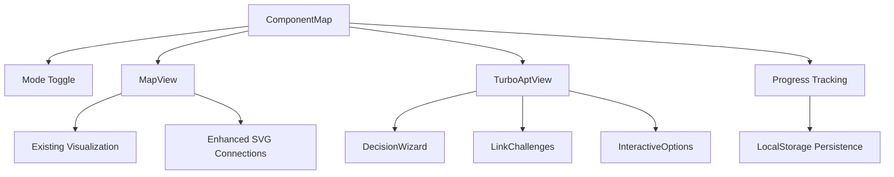

# Component Map Architecture Plan

Based on my analysis of the existing code and incorporating insights from component-map-enhancements.md, I've developed a comprehensive architecture plan for implementing the TurboTax-style component map.

## 1. Architecture Overview

We'll enhance the existing implementation while maintaining compatibility with the current codebase:



## 2. Enhanced Data Model

```typescript
// types/component-map.ts
type ComponentMapMode = 'map' | 'turboApt';

interface DecisionPoint {
  id: string;
  title: string;
  description: string;
  content: React.ReactNode;
  options: DecisionOption[];
  linkChallenge?: {
    prompt: string;
    hint?: string;
    expectedDomain?: string;
  };
  completion?: {
    message: string;
    nextStepId?: string;
  };
}

interface DecisionOption {
  id: string;
  label: string;
  description: string;
  nextStepId?: string;
  isRecommended?: boolean;
}

interface UserProgress {
  completedSteps: string[];
  selectedOptions: Record<string, string>;
  providedLinks: Record<string, string>;
  lastStepId: string;
}

interface ComponentNode {
  id: string;
  name: string;
  type: 'frontend' | 'backend' | 'integration' | 'tool' | 'concept';
  difficulty: 'beginner' | 'intermediate' | 'advanced';
  implemented: boolean;
  codeExamples?: {
    typescript?: string;
    move?: string;
  };
}

interface Connection {
  from: string;
  to: string;
  label?: string;
}
```

## 3. Component Implementation Details

### 3.1 Enhanced ComponentMap.tsx

```typescript
// components/ComponentMap.tsx (enhanced)
export function ComponentMap() {
  // Add mode toggle state
  const [mode, setMode] = useState<ComponentMapMode>('map');
  
  // Existing state from current implementation
  const [zoom, setZoom] = useState(1);
  const [activeNode, setActiveNode] = useState<string | null>(null);
  const containerRef = useRef<HTMLDivElement>(null);
  const { startTour } = useTurboAptos();
  
  // Add user progress tracking
  const [userProgress, setUserProgress] = useState<UserProgress>(() => {
    // Load from localStorage if available
    if (typeof window !== 'undefined') {
      const saved = localStorage.getItem('componentMapProgress');
      return saved ? JSON.parse(saved) : {
        completedSteps: [],
        selectedOptions: {},
        providedLinks: {},
        lastStepId: 'start'
      };
    }
    return {
      completedSteps: [],
      selectedOptions: {},
      providedLinks: {},
      lastStepId: 'start'
    };
  });
  
  // Current step for TurboApt mode
  const [currentStep, setCurrentStep] = useState<string>(userProgress.lastStepId || 'start');
  
  // Save progress whenever it changes
  useEffect(() => {
    if (typeof window !== 'undefined') {
      localStorage.setItem('componentMapProgress', JSON.stringify(userProgress));
    }
  }, [userProgress]);
  
  // Keep existing auto-start tour logic from current implementation
  useEffect(() => {
    // Only run on client side
    if (typeof window === 'undefined') return;
    
    // Check if this is the first time viewing the map
    const hasSeenMap = localStorage.getItem('componentMapTourCompleted');
    
    if (!hasSeenMap) {
      // Small delay to ensure the map is fully rendered
      const timer = setTimeout(() => {
        startTour('component-map');
      }, 1000);
      
      return () => clearTimeout(timer);
    }
  }, [startTour]);
  
  // Keep existing zoom control functions
  const handleZoomIn = () => { /* existing implementation */ };
  const handleZoomOut = () => { /* existing implementation */ };
  const handleResetZoom = () => { /* existing implementation */ };
  const handleNodeClick = (nodeId: string) => { /* existing implementation */ };
  
  // Add TurboApt navigation functions
  const goToNext = () => {
    const currentDecisionPoint = decisionPoints.find(d => d.id === currentStep);
    if (!currentDecisionPoint) return;
    
    const selectedOption = userProgress.selectedOptions[currentStep];
    const option = currentDecisionPoint.options.find(o => o.id === selectedOption);
    
    if (option?.nextStepId) {
      setCurrentStep(option.nextStepId);
      setUserProgress(prev => ({
        ...prev,
        completedSteps: [...prev.completedSteps, currentStep],
        lastStepId: option.nextStepId || currentStep
      }));
    }
  };
  
  const goToPrevious = () => {
    // Find the previous step from the decision flow
    const completedSteps = userProgress.completedSteps;
    if (completedSteps.length > 0) {
      const previousStep = completedSteps[completedSteps.length - 1];
      setCurrentStep(previousStep);
      setUserProgress(prev => ({
        ...prev,
        completedSteps: prev.completedSteps.slice(0, -1),
        lastStepId: previousStep
      }));
    }
  };
  
  // Handle option selection
  const handleOptionSelect = (decisionId: string, optionId: string) => {
    setUserProgress(prev => ({
      ...prev,
      selectedOptions: {
        ...prev.selectedOptions,
        [decisionId]: optionId
      }
    }));
  };
  
  // Handle link challenge completion
  const handleLinkComplete = (decisionId: string, link: string) => {
    setUserProgress(prev => ({
      ...prev,
      providedLinks: {
        ...prev.providedLinks,
        [decisionId]: link
      }
    }));
  };
  
  return (
    <div className="component-map-container">
      {/* Mode toggle button */}
      <div className="mb-4">
        <Button 
          onClick={() => setMode(mode === 'map' ? 'turboApt' : 'map')}
          className="mb-4"
        >
          Switch to {mode === 'map' ? 'Guided' : 'Map'} View
        </Button>
      </div>
      
      {/* Show zoom controls only in map mode */}
      {mode === 'map' && (
        <div className="component-map-controls mb-4 flex gap-2">
          <Button onClick={handleZoomIn} variant="outline" size="sm">Zoom In</Button>
          <Button onClick={handleZoomOut} variant="outline" size="sm">Zoom Out</Button>
          <Button onClick={handleResetZoom} variant="outline" size="sm">Reset View</Button>
        </div>
      )}
      
      {/* Conditional rendering based on mode */}
      {mode === 'map' ? (
        // Map View (existing visualization with enhancements)
        <div 
          ref={containerRef} 
          className="component-map-visualization border rounded-lg p-8 overflow-auto"
          style={{ 
            transform: `scale(${zoom})`,
            transformOrigin: 'top center',
            transition: 'transform 0.3s ease'
          }}
        >
          {/* Existing decision path visualization from current code */}
          <div className="decision-path-container flex flex-col items-center">
            {/* Existing implementation */}
            {/* Add SVG connections */}
            <svg className="connections-layer absolute top-0 left-0 w-full h-full pointer-events-none">
              {/* Path connections between nodes */}
              <path 
                d="M400,120 L400,180" 
                stroke="#818CF8" 
                strokeWidth="2" 
                fill="none"
              />
              {/* Additional path connections */}
            </svg>
          </div>
        </div>
      ) : (
        // TurboApt View (wizard-style experience)
        <div className="decision-wizard border rounded-lg p-8">
          {/* Current decision step */}
          {decisionPoints.map(decision => decision.id === currentStep && (
            <div key={decision.id} className="decision-step">
              <h3 className="text-xl font-bold mb-4">
                {decision.title}
              </h3>
              
              <div className="decision-content mb-6">
                {decision.content}
              </div>
              
              {/* Link challenge if applicable */}
              {decision.linkChallenge && !userProgress.providedLinks[decision.id] && (
                <div className="link-challenge bg-blue-50 p-4 rounded-lg mb-6">
                  <p className="mb-2">{decision.linkChallenge.prompt}</p>
                  {decision.linkChallenge.hint && (
                    <p className="text-gray-500 text-sm mb-2">Hint: {decision.linkChallenge.hint}</p>
                  )}
                  
                  <div className="flex gap-2">
                    <input 
                      type="text" 
                      className="flex-1 p-2 border rounded"
                      placeholder="https://..."
                      onChange={(e) => setLinkInput(e.target.value)}
                    />
                    <Button onClick={() => {
                      // Basic validation
                      if (linkInput.includes(decision.linkChallenge?.expectedDomain || 'aptos')) {
                        handleLinkComplete(decision.id, linkInput);
                      }
                    }}>
                      Verify
                    </Button>
                  </div>
                </div>
              )}
              
              {/* Decision options */}
              <div className="decision-options space-y-2 mb-6">
                {decision.options.map(option => (
                  <div 
                    key={option.id}
                    className={`option p-3 rounded-lg border cursor-pointer transition-all
                      ${userProgress.selectedOptions[decision.id] === option.id 
                        ? 'bg-purple-100 border-purple-500' 
                        : 'bg-gray-50 border-gray-200 hover:bg-gray-100'
                      }
                      ${option.isRecommended ? 'border-l-4 border-l-green-500' : ''}
                    `}
                    onClick={() => handleOptionSelect(decision.id, option.id)}
                  >
                    <div className="font-medium">{option.label}</div>
                    <div className="text-sm text-gray-600">{option.description}</div>
                    {option.isRecommended && (
                      <div className="text-xs text-green-600 mt-1">Recommended</div>
                    )}
                  </div>
                ))}
              </div>
              
              {/* Navigation controls */}
              <div className="navigation-controls flex justify-between items-center">
                <Button 
                  variant="outline"
                  onClick={goToPrevious}
                  disabled={userProgress.completedSteps.length === 0}
                >
                  Previous
                </Button>
                
                {/* Progress indicators */}
                <div className="progress-indicators flex space-x-2">
                  {decisionPoints.map((point, idx) => {
                    const isCompleted = userProgress.completedSteps.includes(point.id);
                    const isCurrent = point.id === currentStep;
                    
                    return (
                      <div 
                        key={point.id}
                        className={`w-2 h-2 rounded-full ${
                          isCurrent ? 'bg-purple-600' : 
                          isCompleted ? 'bg-purple-300' : 'bg-gray-300'
                        }`}
                      />
                    );
                  })}
                </div>
                
                <Button 
                  onClick={goToNext}
                  disabled={!userProgress.selectedOptions[currentStep]}
                >
                  Next
                </Button>
              </div>
            </div>
          ))}
        </div>
      )}
    </div>
  );
}
```

### 3.2 Decision Points Data

```typescript
// data/decision-points.ts
import React from 'react';

const decisionPoints = [
  {
    id: 'start',
    title: 'Start: "I want to build a dApp"',
    description: 'Beginning your journey to build on Aptos',
    content: (
      <div className="p-6 bg-purple-50 rounded-lg">
        <p className="mb-4">
          Welcome to your journey of building a decentralized application on Aptos!
          This guided experience will help you make key decisions for your project.
        </p>
        <p>
          Choose your path wisely to create an efficient, secure, and user-friendly dApp.
        </p>
      </div>
    ),
    options: [
      {
        id: 'begin',
        label: 'Begin My Journey',
        description: 'Start exploring the key decisions for your Aptos dApp',
        nextStepId: 'evaluate'
      }
    ]
  },
  {
    id: 'evaluate',
    title: 'Evaluate Aptos vs Other Chains',
    description: 'Understand the advantages of Aptos',
    content: (
      <div className="p-6 bg-blue-50 rounded-lg">
        <p className="mb-4">
          Aptos offers several advantages over other blockchains:
        </p>
        <ul className="list-disc pl-5 space-y-2 mb-4">
          <li>Move language for safer smart contracts</li>
          <li>Fast finality with high throughput</li>
          <li>Strong developer tooling and support</li>
          <li>Resource-oriented programming model</li>
        </ul>
        <p>
          Consider these factors when choosing your blockchain platform.
        </p>
      </div>
    ),
    linkChallenge: {
      prompt: 'Find and paste a link to the Aptos documentation to proceed:',
      hint: 'Look for the official Aptos docs website',
      expectedDomain: 'aptos.dev'
    },
    options: [
      {
        id: 'choose-aptos',
        label: 'Choose Aptos',
        description: 'Move forward with Aptos as your blockchain platform',
        nextStepId: 'contract',
        isRecommended: true
      },
      {
        id: 'undecided',
        label: 'I need more information',
        description: 'Explore more resources before deciding',
        nextStepId: 'contract'
      }
    ]
  },
  // Additional decision points following same structure
];

export default decisionPoints;
```

## 4. Integration with Existing CodeBase

### 4.1 ComponentMapDialog.tsx Integration

The existing ComponentMapDialog.tsx will continue to work with our enhanced ComponentMap:

```typescript
// components/ComponentMapDialog.tsx (unchanged)
export function ComponentMapDialog({ open, onOpenChange }: ComponentMapDialogProps) {
  // Existing implementation
  return (
    <Dialog open={open} onOpenChange={onOpenChange}>
      <DialogContent className="max-w-[90vw] max-h-[90vh] w-[1200px]">
        {/* Dialog content */}
        <div className="overflow-auto p-4 h-[70vh]">
          <ComponentMap /> {/* Enhanced component works here */}
        </div>
      </DialogContent>
    </Dialog>
  );
}
```

### 4.2 Integration with Tours

We'll keep the existing tour integration and enhance it to introduce the TurboApt mode:

```typescript
// tours/ComponentMapTour.tsx (enhanced)
export const ComponentMapTour: TourDefinition = {
  id: 'component-map',
  steps: [
    {
      target: '.component-map-container',
      title: 'Interactive Component Map',
      content: 'This is your Aptos ecosystem map. You can explore it in two ways: Map View or Guided Setup.',
      placement: 'top',
    },
    {
      target: 'button:contains("Switch to")',
      title: 'View Toggle',
      content: 'Click here to switch between Map View and Guided Setup. Map View shows everything at once, while Guided Setup walks you through step by step.',
      placement: 'bottom',
    },
    // Existing tour steps
    {
      target: '.decision-node.start-node',
      title: 'Starting Point',
      content: 'This is where your journey begins. Each decision point will help you understand different aspects of Aptos development.',
      placement: 'bottom',
    },
    // Additional steps
  ],
  onComplete: () => {
    localStorage.setItem('componentMapTourCompleted', 'true');
  },
};
```

## 5. Testing Strategy

We'll implement comprehensive tests for both Map and TurboApt modes:

```typescript
// __tests__/components/ComponentMap.test.tsx
import { render, screen, fireEvent } from '@testing-library/react';
import { ComponentMap } from '@/components/ComponentMap';

describe('ComponentMap', () => {
  beforeEach(() => {
    // Clear localStorage before each test
    if (typeof window !== 'undefined') {
      localStorage.clear();
    }
  });
  
  it('renders in map view by default', () => {
    render(<ComponentMap />);
    expect(screen.getByText('Hacker\'s Decision Pathway')).toBeInTheDocument();
  });
  
  it('switches to TurboApt view when toggled', () => {
    render(<ComponentMap />);
    const switchButton = screen.getByText('Switch to Guided View');
    fireEvent.click(switchButton);
    expect(screen.getByText('Start: "I want to build a dApp"')).toBeInTheDocument();
  });
  
  it('saves progress in TurboApt mode', () => {
    render(<ComponentMap />);
    
    // Switch to TurboApt view
    fireEvent.click(screen.getByText('Switch to Guided View'));
    
    // Start journey
    const beginButton = screen.getByText('Begin My Journey');
    fireEvent.click(beginButton);
    
    // Select an option in first real step
    fireEvent.click(screen.getByText('Choose Aptos'));
    
    // Go to next step
    fireEvent.click(screen.getByText('Next'));
    
    // Verify progress was saved
    expect(localStorage.getItem('componentMapProgress')).not.toBeNull();
    
    const progress = JSON.parse(localStorage.getItem('componentMapProgress') || '{}');
    expect(progress.selectedOptions).toHaveProperty('evaluate', 'choose-aptos');
  });
  
  it('handles link challenges', () => {
    render(<ComponentMap />);
    
    // Switch to TurboApt view
    fireEvent.click(screen.getByText('Switch to Guided View'));
    
    // Navigate to a step with link challenge
    fireEvent.click(screen.getByText('Begin My Journey'));
    
    // Enter link
    const linkInput = screen.getByPlaceholderText('https://...');
    fireEvent.change(linkInput, { target: { value: 'https://aptos.dev/docs' } });
    
    // Verify link
    fireEvent.click(screen.getByText('Verify'));
    
    // Check if verification was successful
    expect(screen.queryByText('Hint:')).not.toBeInTheDocument();
  });
});
```

## 6. Implementation Timeline

### Phase 1: Foundation (Week 1)
- Update ComponentMap.tsx with mode toggle
- Implement basic TurboApt mode structure
- Create decision points data structure

### Phase 2: Interactive Features (Week 2)
- Add link challenges
- Implement progress tracking and persistence
- Enhance navigation and step flows

### Phase 3: Polish & Integration (Week 3)
- Add animations and transitions
- Improve visual styling
- Test and refine both modes