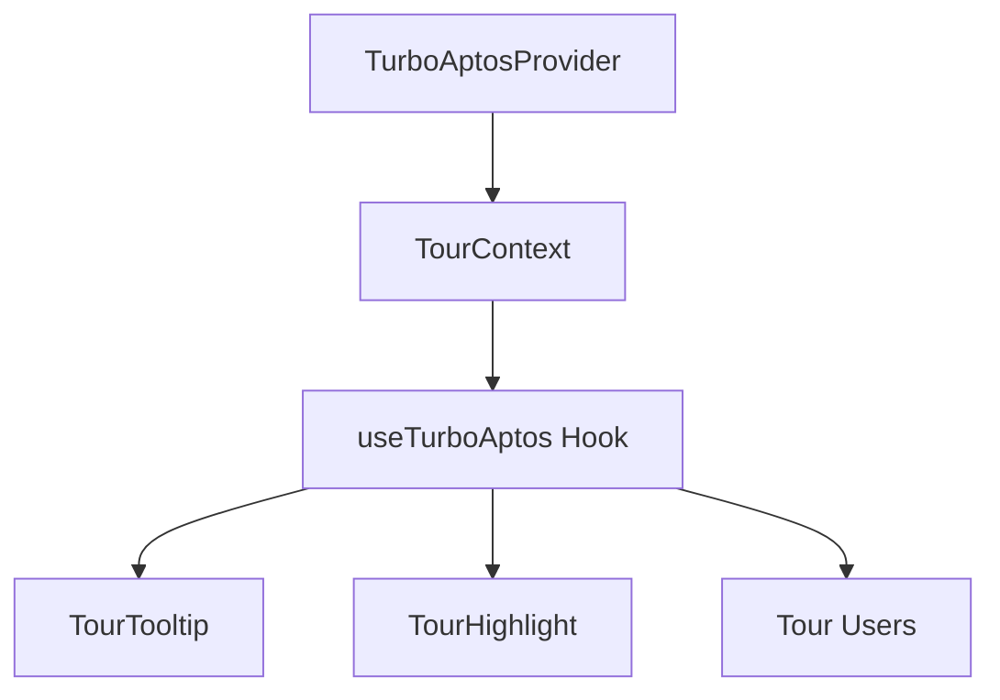

# TurboTax-Style Enhancements for Apt-ID

This guide explains the TurboTax-style guided experiences added to Apt-ID, how they work, and how to test them.

## Overview

We've implemented the following enhancements:

1. **TurboAptos Tour System** - A reusable guided tour system that provides step-by-step instructions
2. **How to Use Button** - Walkthrough for getting a testnet ANS name and accessing the secret map
3. **Feedback Modal** - Always-visible button for collecting user feedback
4. **Enhanced Component Map** - Interactive visualization with guided exploration

## Key Components

### 1. TurboAptos Core Components

The tour system is built with the following components:

- `TurboAptosProvider`: Context provider that manages tour state
- `TourHighlight`: Visual highlight that draws attention to UI elements
- `TourTooltip`: Instructions and navigation for each tour step
- `useTurboAptos`: Hook for accessing the tour context

### 2. Tours

Two guided tours have been implemented:

- **How to Use**: Shows users how to get a testnet ANS name and access the secret component map
- **Component Map**: Explains the Aptos ecosystem components and developer decision pathways

### 3. UI Components

Additional UI components for user interaction:

- `HowToUseButton`: Launches the "How to Use" tour
- `FeedbackButton`: Opens the feedback collection modal
- `FeedbackModal`: Form for collecting user feedback

## How to Test

### Setting Up the Environment

1. Make sure you have the latest code with the TurboTax enhancements
2. Run the development server with `pnpm dev` (or `npm run dev`)
3. Open your browser to the local Apt-ID app

### Testing the How to Use Tour

1. Look for the "How to Use" button in the bottom right corner of the screen
2. Click it to start the guided tour
3. Follow the step-by-step instructions
4. Navigate through the tour using the "Next" and "Back" buttons
5. You can skip the tour at any time by clicking "Skip"

### Testing the Feedback Modal

1. Look for the "Feedback" button in the bottom right corner of the screen
2. Click it to open the feedback modal
3. Try submitting feedback with different ratings and categories
4. Test the form validation by trying to submit without required fields
5. Check that the thank you message appears after submission

### Testing the Component Map Tour

To test the Component Map tour, you need access to the secret button:

1. Update the `ALLOWLISTED_NAMES` array in `typescript/src/constants.ts` to include your ANS name
2. Restart the development server
3. Connect your wallet in the app
4. Click the "View Component Map" button that appears in the bottom right
5. The tour should start automatically the first time you open the map
6. Navigate through the tour to learn about different decision points
7. Try clicking on different nodes to see their details

## Implementation Details

### Tour System Architecture

The tour system uses React Context for state management:

### UI Layout

The UI elements are positioned strategically:

- **How to Use Button**: Bottom right, top position (z-index: 40)
- **Feedback Button**: Bottom right, middle position (z-index: 40)
- **Secret Button**: Bottom right, lowest position (z-index: 50)
- **Tour Tooltips**: Position dynamically based on the target element (z-index: 50)
- **Tour Highlights**: Position dynamically based on the target element (z-index: 40)

### Tour Persistence

Tour completion status is stored in localStorage:

- `howToUseTourCompleted`: Set to "true" when the How to Use tour is completed
- `componentMapTourCompleted`: Set to "true" when the Component Map tour is completed

## Advanced Customization

### Adding New Tours

To create a new tour:

1. Create a new tour configuration file in `typescript/src/tours/`
2. Export the tour from `typescript/src/tours/index.tsx`
3. The tour will automatically be available through the `TurboAptosProvider`

### Customizing Tour Styles

Tour styles can be modified in:

- `typescript/src/app/globals.css`: Contains animations and basic styles
- Individual component files: Contain component-specific styling

## Troubleshooting

### Common Issues

- **Tour doesn't start**: Check if the tour is marked as completed in localStorage. Try clearing localStorage or using an incognito window.
- **Tooltip position is incorrect**: Ensure the target element has the correct data attribute and is visible in the viewport.
- **Tour highlight doesn't appear**: Check that the target element exists and has a proper data-node-id attribute.

### Debugging

The tour system logs tour completion to the console:
- `console.log('How to Use tour completed')`
- `console.log('Component Map tour completed')`

You can add more console logs for debugging specific issues.

## Next Steps for Future Development

1. **More Sophisticated Animations**: Add animated connections between decision points in the component map
2. **Tour Analytics**: Track user interaction with tours to improve the experience
3. **Additional Tours**: Create tours for other aspects of the application
4. **Localization**: Add support for multiple languages

---

This implementation provides a solid foundation for enhancing the user experience with guided tours and feedback collection, making it easier for new developers to understand and use Apt-ID.